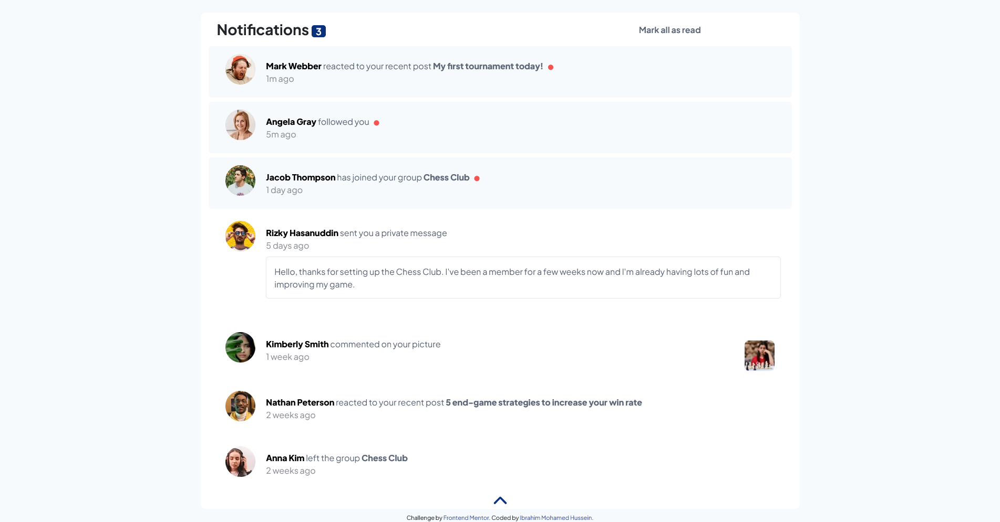

# Frontend Mentor - Notifications page solution

This is a solution to the [Notifications page challenge on Frontend Mentor](https://www.frontendmentor.io/challenges/notifications-page-DqK5QAmKbC). Frontend Mentor challenges help you improve your coding skills by building realistic projects.

## Table of contents

- [Overview](#overview)
  - [The challenge](#the-challenge)
  - [Screenshot](#screenshot)
  - [Links](#links)
- [My process](#my-process)
  - [Built with](#built-with)
  - [What I learned](#what-i-learned)
  - [Useful resources](#useful-resources)
- [Author](#author)

## Overview

### The challenge

Users should be able to:

- Distinguish between "unread" and "read" notifications
- Select "Mark all as read" to toggle the visual state of the unread notifications and set the number of unread messages to zero
- View the optimal layout for the interface depending on their device's screen size
- See hover and focus states for all interactive elements on the page

### Screenshot



### Links

- Solution URL: [Add solution URL here](https://your-solution-url.com)
- Live Site URL: [Add live site URL here](https://https://Ibrahim-MohamedH.github.io/notifications-page)

## My process

### Built with

- Semantic HTML5 markup
- CSS custom properties
- Bootstrap
- JavaScript
- Jquery

### What I learned

- How to use Jquery to animate a dropdown notification bar.

```js
$(".arrow").click(() => {
  if (notification_pannel.height() == 0) {
    notification_pannel.css(
      "height",
      `${notification_pannel.prop("scrollHeight")}px`
    );
    $(".arrow").addClass("rotation");
    for (let n = 0; n < notification.length; n++) {
      notification.eq(n).addClass("animate__animated animate__backInUp");
      notification.eq(n).addClass(`animate__delay-${n}s`);
    }
  } else if (notification_pannel.height() != 0) {
    for (let n = 0; n < notification.length; n++) {
      notification.eq(n).removeClass("animate__animated animate__backInUp");
      notification.eq(n).removeClass(`animate__delay-${n}s`);
    }
    notification_pannel.css("height", "0");
    $(".arrow").removeClass("rotation");
  }
});
```

- Unmark seen notification based on click on the notification.

```js
notification.click((e) => {
  if (notification.hasClass("unread")) {
    $(e.target).removeClass("unread");
    $(e.target).find(".unread-span").addClass("none");
    counter();
  }
});
```

### Useful resources

- [Jquery documentation](https://api.jquery.com/hasClass/) - This helped me for XYZ reason. I really liked this pattern and will use it going forward.
- [Example resource 2](https://www.example.com) - This is an amazing article which helped me finally understand XYZ. I'd recommend it to anyone still learning this concept.

## Author

- Website - [Ibrahim-MohamedH](https://github.com/Ibrahim-MohamedH)
- Frontend Mentor - [@Ibrahim-MohamedH](https://www.frontendmentor.io/profile/Ibrahim-MohamedH)
